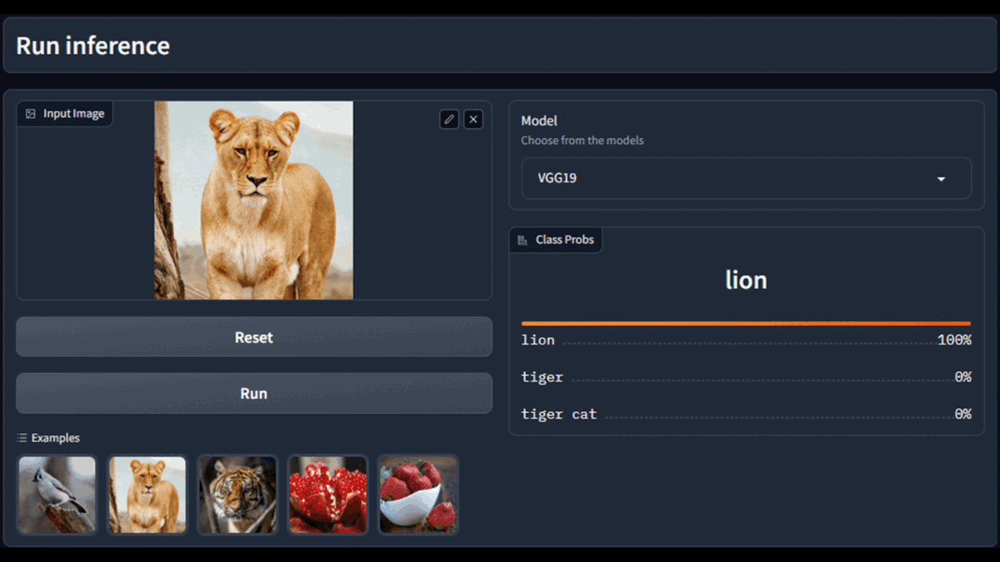

# Guided Backpropagation Visualization

This project is a Gradio app that visualize activation maps and input gradients for deep learning models interactively. Using guided backpropagation, spatial regions of input images that most contribute to the prediction are highlighted. There are two models available: VGG19 and AlexNet. To get obtain activation maps and input gradients, Pytorch's forward and backward hooks are used.

<p align="center">

</p>

### Run on HuggingFace

### Run locally

Create a conda environment and install required packages

```
conda create -n grad_app python=3.11
pip install -r requirements.txt
```

Run the application

```
python app.py
```

## Contributions
- [Batuhan Tosun](https://github.com/batuhanntosun)
- [Bilal Kabas](https://github.com/bilalkabas)
